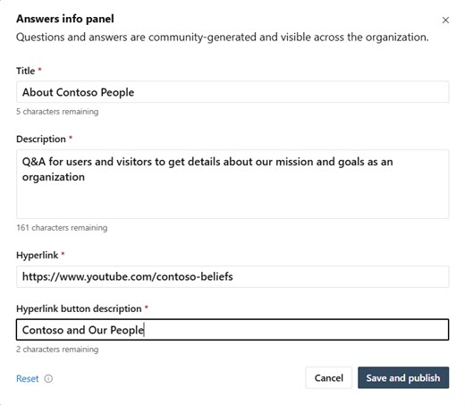

# Admin tasks for Answers in Viva Engage

Administration of Answers requires either an Engage admin or Answers admin role.

>[!NOTE]
>The Microsoft 365 Global administrator can designate an Answers admin by [adding a Knowledge manager in Microsoft Entra ID](/azure/active-directory/fundamentals/active-directory-users-assign-role-azure-portal?context=%2Fazure%2Factive-directory%2Froles%2Fcontext%2Fugr-context). Knowledge managers are Answers admins and have elevated permissions over end users. For more information, see [Manage admin roles in Viva Engage](/Viva/engage/eac-key-admin-roles-permissions).

## Provide guidance using the Answers info panel

Answers admins and Engage admins use the **Answers info panel** to provide guidance to employees on how to use Answers in the organization. You can edit its title, provide explanatory text, and provide an informational link. By default, the Answers info panel is only visible to administrators. It appears as the top right panel on the Answers page for Admins and for users (when published).

After an admin edits, saves and publishes the info panel, all other employees with access to Answers in Viva Engage can see it. Ensure that the panel offers clear and useful information to Answers users about what they can expect to find there.

>[!NOTE]
> Users can't edit or change the Answers info panel.

:::image type="content" source="../media/engage/admin/ans-info-pan-admin1.png" lightbox="../media/engage/admin/ans-info-pan-admin1.png" alt-text="Screenshot of the Answers info panel with guidelines option.":::

### Edit the Answers info panel

Take the following steps to edit the Answers info panel:

<table>
<tr><td>1. Select the edit icon from the top right of the Answers info panel. 
2. Enter content that's specific to your organization. The <b>Title</b> field is limited to 25 characters. To ensure your changes get saved, make sure to fill out all fields of the <b>Answers info panel</b> dialog, including the hyperlink and its description. 
3. Select <b>Save and publish</b> to allow all Answers users to view the panel content.  </td>

<td></td></tr>
</table>

### Reset the Answers info panel

At another point, you might want to reset the information in the Answers info panel.

1. Select the edit icon from the top right corner of the Answers info panel.
1. Select **Reset** in the **Answers info panel** dialog.
<!--
:::image type="content" source="../media/engage/admin/ans-info-pan-admin3.png" lightbox="../media/engage/admin/ans-info-pan-admin3.png" alt-text="Screenshot showing the info panel reset option.":::-->

## Use topics in the Answers experience

Topics encapsulate important questions asked by users in the Viva Engage network. Users can add ongoing topics to their Viva Engage feed by selecting them in the **Topics to follow** panel.

### Understanding topics

Topics work on a completely local level for both admins and for end uses of Viva Engage. If an admin wants to create new topics, they fall into two categories:

| **Topic type** | **Use Case** |
| Followed Topics to follow | ...appear in the **Topics to follow** panel. |
| Subscribed Topics         | These topics don't appear in the **Topics to follow** panel. |

### Add topics to the Answers experience

When an admin adds a topic to **Topics to follow**, the users see... WHAT?

Do the following to create a new topic:

1. Select **Answers**, go to **Topics to follow** and select **Discover more topics**. The main Topics page appears.
2. Select **Create Topic.
3. Enter the **Topic name**.
4. Enter a **Description**.

### Remove topics from Answers

To remove a topic or multiple topics at once, admins can take the following steps:

1. Select **Answers**, go to **Topics to follow** and select **Discover more topics**. The main Topics page appears.
2. Search by topic name, or filter by "All" to browse topics.
3. To edit and remove any single topic, select the ellipsis icon (`...`) on any topic.
4. To select and delete more than one topic from Topics to follow, use the check box on each, and select the trashcan. 
    Removing a topic also removes all applications of the topic. You can't undo this action.

## View Global Answers analytics

As an Answers admin, you can open and view *Global Answers analytics*. The page provides information about engagement and the success rates for Answers in your community to assist the user base.

1. Go to the **Explore** > **Analytics** page of Viva Engage.
1. Select the **Global Answers analytics** tab. The analytics dashboard shows an overview and relevant insights about knowledge sharing activity across Answers in Viva.

For more information about analytics management in the [Viva Engage admin center](/Viva/engage/eac-overview), see [View and manage analytics in Viva Engage](/Viva/engage/analytics).

:::image type="content" alt-text="Screenshot of the Global Answers analytics dashboard in Viva Engage." source="/viva/media/engage/admin/global-answers-analytics.png" lightbox="/viva/media/engage/admin/global-answers-analytics.png":::

The following metrics appear for Global Answers analytics:

| Metric | Description |
|---|---------|
|**Time saved by Answers**| The time the organization saves, based on question-and-answer usage. |
|**Total questions**| The total number of questions asked by users.|
|**Question views**| The total number of views across all questions.|
|**Total answers**| The total number of answers provided by users.|
|**Total best answers**| The total number of answers marked as best answer.|
|**Answer rate**| The ratio of questions that have answers to total questions.|
|**Best answer rate**| The ratio of questions with best answers to total questions.|
|**Median time to first answer**| The median time it takes for a question to receive its first answer.|
|**Median time to best answer**| The median time it takes for a question to receive its first best answer.|
|**Median questions asked per user**| The median number of questions asked by each user.|
|**Median questions viewed per user**| The median number of questions viewed by each user.|
|**Median answers per user**| The median number of answers provided by each user.|
|**Median best answers per user**| The median number of best answers provided by each user.|
|**Top questions across your org**| A table of the top questions with the most views, votes, reactions, and answers across your org.|
|**User engagement distribution**| A distribution of all users split by active engagements (ask, answer, vote, reactions, comments) and passive engagements (question views).|
|**Question views**| 
<!--|**Global time saved** | Time saved across the organization. Based on Viva Engage research, the total shows that each question-and-answer pair saves people an average of 15 minutes. As more people discover existing answers to their questions, the organization saves more time.|-->

>[!NOTE]
> Analytics aren't live. They update every 24 hours.

## See also

[Answers in Viva: Frequently asked questions (FAQ)](/Viva/engage/eac-answers-faq)

[Key admin roles and permissions in Viva Engage](/Viva/engage/eac-key-admin-roles-permissions)

[View and manage analytics in Viva Engage](/Viva/engage/analytics)
